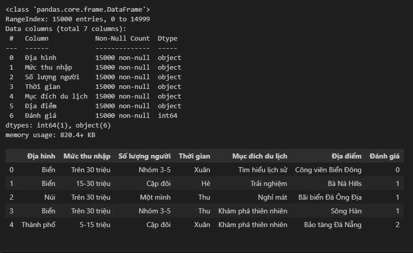
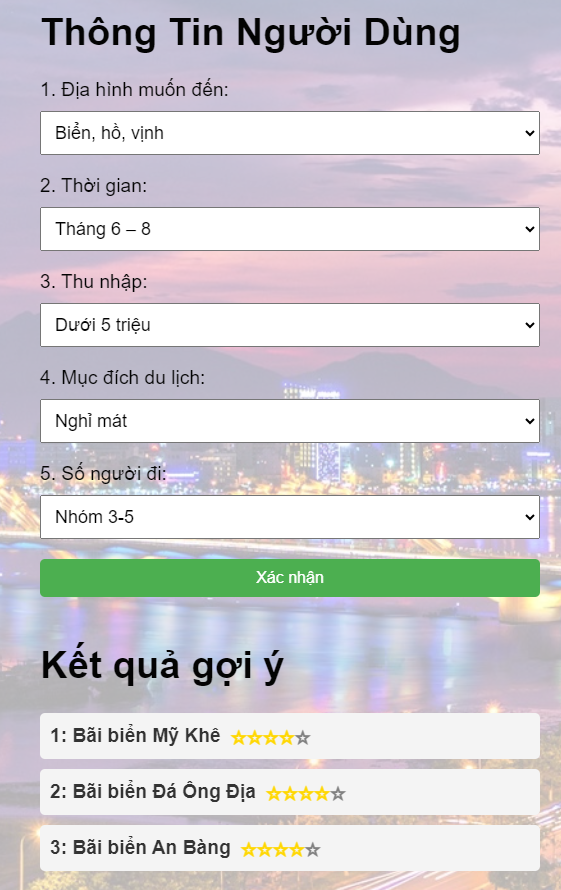

# Web app gợi ý địa điểm du lịch tại Đà Nẵng

## Giới thiệu chung

Cốt lõi của chương trình là xây dựng mô hình Machine learning (ML) với 5 đặc trưng người dùng:

    - Mức thu nhập: ["Dưới 5 triệu", "5-15 triệu", "15-30 triệu", "Trên 30 triệu"]

    - Địa hình: ["Biển", "Núi", "Thành phố"]

    - Thời gian: ["Xuân", "Hè", "Thu", "Đông"]

    - Mục đích du lịch: ["Khám phá thiên nhiên", "Tìm hiểu lịch sử", "Tìm hiểu văn hóa", "Tâm linh", "Trải nghiệm", "Nghỉ mát"]

    - Số lượng người: ['Một mình', 'Cặp đôi', 'Nhóm 3-5', 'Nhóm 6-10', 'Hơn 10 người']

Khi người dùng nhập 5 thông tin trên, mô hình sẽ đưa ra 3 địa điểm phù hợp nhất trong số danh sách gồm 20 địa điểm du lịch tại Đà Nẵng:

    - Bãi biển Mỹ Khê

    - Cầu Rồng

    - Ngũ Hành Sơn

    - Bà Nà Hills

    - Chùa Linh Ứng

    - Cầu Thuận Phước

    - Bãi biển Non Nước

    - Sông Hàn

    - Làng Đá Mỹ Đức

    - Công viên Châu Á

    - Bảo tàng Chăm

    - Bãi biển An Bàng

    - Công viên Biển Đông

    - Vinpearl Land Nam Hội An

    - Quảng trường Trung tâm

    - Bảo tàng Đà Nẵng

    - Công viên 29/3

    - Khu du lịch sinh thái Cồn Ngọc

    - Bãi biển Đá Ông Địa

    - Hội An

## Cơ sở xây dựng mô hình

### Tập dữ liệu

Thu thập dữ liệu từ khảo sát người dùng lấy thông tin về 5 đặc trưng trên, địa điểm du lịch và đánh giá của người dùng về địa điểm du lịch đó (0 -> 5*)

### Sử dụng mô hình RandomForestClassifier

Rừng cây ngẫu nhiên là một mô hình học máy mạnh mẽ cho dữ liệu phân lớp như trên

Đầu vào: 5 đặc trưng người dùng và địa điểm du lịch

Đầu ra: đánh giá của người dùng về điểm du lịch đó ( từ 0* đến 5*)

Như vậy khi người dùng nhập vào thông tin của mình, sẽ kết hợp lần lượt với 20 điểm du lịch để hình thành đầu vào cho mô hình

Sau đó, mô hình đưa ra dự đoán về đánh giá người dùng về 20 địa điểm du lịch đó.

Chương trình sẽ lấy ra 3 địa điểm có đánh giá cao nhất để gợi ý cho người dùng

